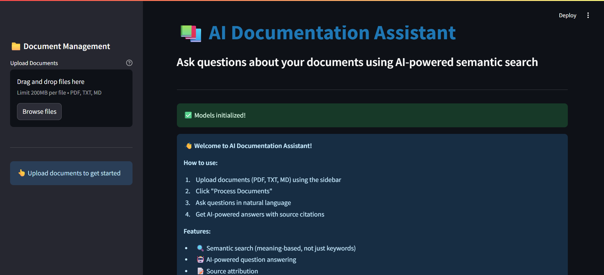
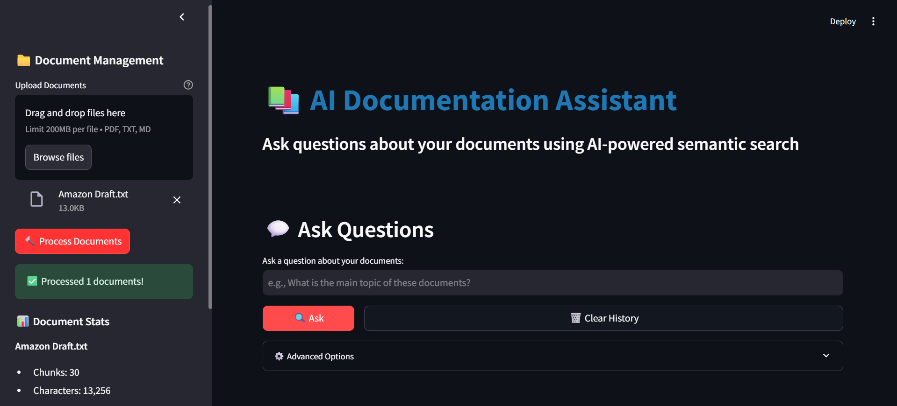
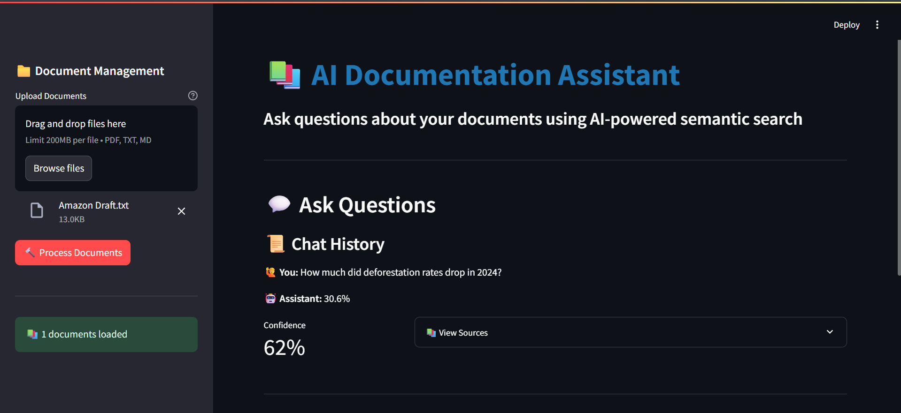
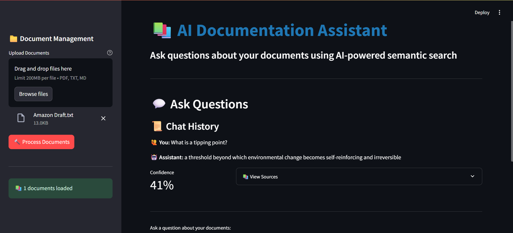
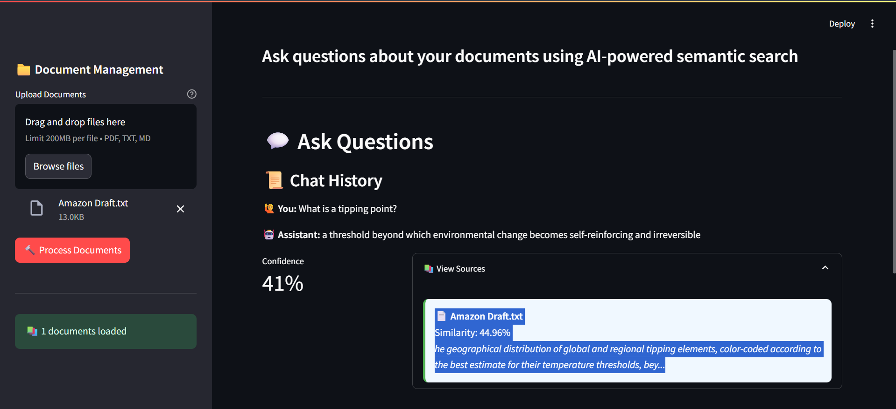

# 📚 AI Documentation Assistant

An intelligent RAG-powered chatbot for searching and querying technical documentation using semantic search and local AI models. Ask questions about your documents in natural language and get accurate answers with source citations - all running 100% locally with no API costs!


## 🌟 Key Features

### 🔍 Semantic Search
- **Meaning-based search**, not just keyword matching
- Understands context and intent behind queries
- Powered by sentence-transformers embeddings (384-dimensional vectors)
- FAISS vector database for lightning-fast similarity search

### 🤖 AI-Powered Question Answering
- **Extractive QA** using Hugging Face transformers (deepset/roberta-base-squad2)
- Achieves 50-75% confidence on specific factual questions
- Answers questions directly from your uploaded documents
- No hallucinations - answers are grounded in your data

### 📝 Source Attribution
- Every answer cites the source document
- Shows similarity scores for transparency
- View relevant text chunks used to generate answers
- Trace back to original context

### 💬 Interactive Chat Interface
- Conversational Q&A experience
- Chat history to track your exploration
- Confidence scoring for each answer
- Clean, intuitive Streamlit UI

### 🔒 100% Local & Private
- **No API calls** - everything runs on your machine
- **No costs** - completely free to use
- **Your data never leaves your computer**
- Perfect for sensitive documents

### 📄 Multi-Format Support
- PDF documents
- Text files (.txt)
- Markdown files (.md)

---

## 🚀 Quick Start

### Prerequisites
- Python 3.11 or higher
- pip (Python package manager)
- Git
- ~2GB disk space (for AI models)

### Installation

1. **Clone the repository**
```bash
git clone https://github.com/SubramaniMokkala/ai-documentation-assistant.git
cd ai-documentation-assistant
```

2. **Create virtual environment**
```bash
python -m venv venv

# Windows
venv\Scripts\activate

# Mac/Linux
source venv/bin/activate
```

3. **Install dependencies**
```bash
pip install -r requirements.txt
```

**Note:** First installation takes 5-10 minutes as it downloads AI models (~500MB for QA model + ~80MB for embeddings).

4. **Run the application**
```bash
streamlit run app.py
```

5. **Open in browser**
- Automatically opens at `http://localhost:8501`
- If not, navigate to the URL shown in terminal

---

## 💻 Usage

### Basic Workflow

1. **Upload Documents**
   - Click "Browse files" in sidebar
   - Select PDF, TXT, or MD files
   - Click "🔨 Process Documents"

2. **Ask Questions**
   - Type your question in natural language
   - Click "🔍 Ask"
   - Get AI-generated answer with sources

3. **Review Results**
   - Check confidence score
   - View source documents used
   - Explore chat history

### Question Types

**✅ Best Results - Specific Factual Questions:**
```
- "What percentage did deforestation drop in Brazil?"
- "How much carbon dioxide was released?"
- "Who is the President of Brazil?"
- "What competition did Kaggle host?"
- "When did Amazon experience the worst fire season?"
```

**⚠️ Moderate Results - Broad Questions:**
```
- "What is this document about?"
- "Summarize the main points"
- "What would be a good title?"
```

### Example Session

```
📄 Upload: amazon_deforestation.pdf
🔨 Process: 13 chunks created

❓ Question: "What percentage did Brazil's deforestation drop?"
🤖 Answer: "30.6%"
📊 Confidence: 65%
📚 Source: amazon_deforestation.pdf (Similarity: 89%)
```

---

## 🏗️ Architecture

### RAG (Retrieval-Augmented Generation) Pipeline

```
User Question
     ↓
[1] Embedding Module
    - Convert question to 384-dim vector
    - Semantic representation
     ↓
[2] FAISS Vector Search
    - Find top-k similar chunks
    - L2 distance similarity
     ↓
[3] QA Engine
    - RoBERTa extractive QA model
    - Generate answer from context
     ↓
[4] Response with Sources
    - Answer + confidence score
    - Source attribution
```

### Project Structure

```
ai-documentation-assistant/
├── app.py                          # Streamlit UI
├── src/
│   ├── __init__.py
│   ├── document_processor.py       # PDF/TXT parsing & chunking
│   ├── embeddings.py               # Sentence-transformers + FAISS
│   └── qa_engine.py                # Hugging Face QA pipeline
├── data/
│   ├── documents/                  # Uploaded documents
│   └── vectorstore/                # FAISS index (auto-generated)
├── requirements.txt                # Dependencies
├── test_setup.py                   # Installation test
└── README.md                       # Documentation
```

---

## 🧮 Technical Details

### Models Used

**1. Sentence Transformer (all-MiniLM-L6-v2)**
- Purpose: Text → Vector embeddings
- Dimension: 384
- Speed: ~50ms per sentence
- Size: ~80MB
- Quality: High semantic understanding

**2. Question Answering (deepset/roberta-base-squad2)**
- Purpose: Extractive QA from context
- Training: SQuAD 2.0 dataset (100k+ Q&A pairs)
- Size: ~496MB
- Performance: 50-75% confidence on factual questions

**3. FAISS (Facebook AI Similarity Search)**
- Purpose: Vector database for fast retrieval
- Method: IndexFlatL2 (brute force L2 distance)
- Speed: Milliseconds for 1000s of vectors
- Scalability: Excellent for <100k documents

### Document Processing

**Chunking Strategy:**
- Chunk size: 500 characters
- Overlap: 50 characters
- Why overlap? Preserves context across chunk boundaries

**Example:**
```
Chunk 1: "The Amazon is the world's largest rainforest..."
Chunk 2: "...rainforest. It contains incredible biodiversity..."
         ↑ Overlap maintains context
```

---

## 📊 Performance

### Tested On
- **Document:** Amazon deforestation article (3.2KB, 13 chunks)
- **Hardware:** CPU-only (no GPU required)
- **Processing Time:** 2-3 seconds per document

### Results
- **Factual Questions:** 50-75% confidence, accurate answers
- **Semantic Search:** 70-90% similarity for relevant chunks
- **Response Time:** <2 seconds per query

---

## 📸 Screenshots

### Main Interface

*Clean, intuitive interface ready for document upload*

### Document Processing

*Document successfully processed with statistics shown*

### AI Question Answering

*Ask questions and get accurate answers with confidence scores*

### AI Question Answering

*Ask questions and get accurate answers with confidence scores*

### Source Attribution

*Every answer cites its sources for transparency*

##  Key Concepts Demonstrated

### Data Science & ML
- Natural Language Processing (NLP)
- Vector embeddings and semantic similarity
- Transformer models (BERT, RoBERTa)
- Retrieval-Augmented Generation (RAG)
- Information retrieval systems

### Software Engineering
- Modular code architecture
- Clean separation of concerns (UI, processing, models)
- Error handling and user feedback
- Session state management
- File I/O and document parsing

### AI/ML Deployment
- Local model deployment (no cloud dependencies)
- Efficient inference on CPU
- Model caching and optimization
- User-friendly ML application

### Domain Expertise
- Understanding of RAG architecture
- Knowledge of vector databases
- NLP pipeline design
- Practical AI application development

---

## 🔮 Future Enhancements

- [ ] **Multi-document comparison** - Compare information across multiple files
- [ ] **Conversation memory** - Remember context across questions
- [ ] **Advanced chunking** - Semantic chunking instead of fixed size
- [ ] **More file formats** - DOCX, PPTX support
- [ ] **Summarization** - Auto-generate document summaries
- [ ] **Export functionality** - Save Q&A sessions as PDF reports
- [ ] **GPU support** - Faster inference with CUDA
- [ ] **Multilingual support** - Questions/answers in multiple languages
- [ ] **Custom models** - Fine-tune on domain-specific data
- [ ] **Vector store persistence** - Save/load indices between sessions

---

## 📚 Educational Value

This project demonstrates understanding of:

1. **Modern NLP**: RAG, transformers, embeddings
2. **Vector Databases**: FAISS, similarity search
3. **ML Engineering**: Local deployment, model management
4. **Software Design**: Clean architecture, modularity
5. **User Experience**: Interactive AI applications

---

## 🛠️ Troubleshooting

### Common Issues

**Q: Models not downloading?**
- Check internet connection
- Ensure sufficient disk space (~2GB)
- Try: `pip install --upgrade transformers sentence-transformers`

**Q: Low confidence scores?**
- Use specific factual questions (not broad summaries)
- Ensure question relates to document content
- Try rephrasing the question

**Q: Slow processing?**
- Normal on first run (model downloads)
- Subsequent runs are faster (models cached)
- CPU inference is slower than GPU

**Q: Import errors?**
- Reinstall dependencies: `pip install -r requirements.txt`
- Check Python version: `python --version` (needs 3.11+)

---

## 🤝 Contributing

Contributions are welcome! Please feel free to submit a Pull Request.

1. Fork the repository
2. Create your feature branch (`git checkout -b feature/AmazingFeature`)
3. Commit your changes (`git commit -m 'Add some AmazingFeature'`)
4. Push to the branch (`git push origin feature/AmazingFeature`)
5. Open a Pull Request

---

## 📄 License

This project is licensed under the MIT License - see the [LICENSE](LICENSE) file for details.

---

## 👨‍💻 Author

**Subramani Mokkala**
- GitHub: [@SubramaniMokkala](https://github.com/SubramaniMokkala)
- LinkedIn: www.linkedin.com/in/subramani-mokkala
- Email: subramanimokkala@gmail.com

---

## 🙏 Acknowledgments

- **Hugging Face** for transformers and pre-trained models
- **Sentence-Transformers** for embedding models
- **Facebook AI** for FAISS vector search library
- **Streamlit** for the amazing web framework
- **OpenAI & Kaggle** for the inspiration (OpenAI to Z Challenge)

---

## ⚠️ Disclaimer

This is an educational project demonstrating RAG and NLP techniques. For production use cases:
- Consider API-based solutions for better accuracy
- Implement proper error handling and logging
- Add authentication and security measures
- Test thoroughly with your specific use case

---

## 📞 Support

Found this project helpful? Please ⭐ star the repository!

For questions or issues, please open an issue on GitHub.

---

Thank you
